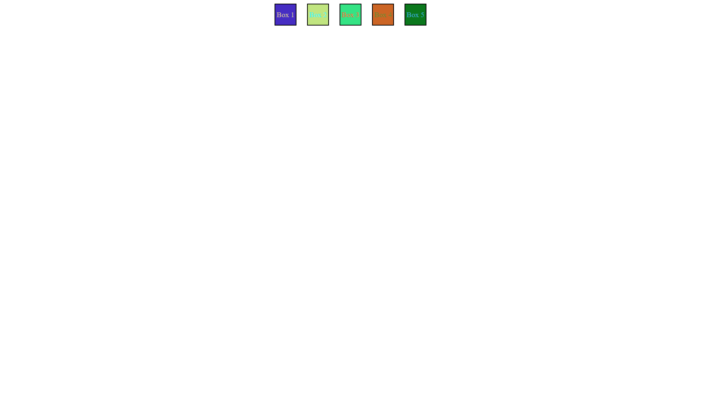
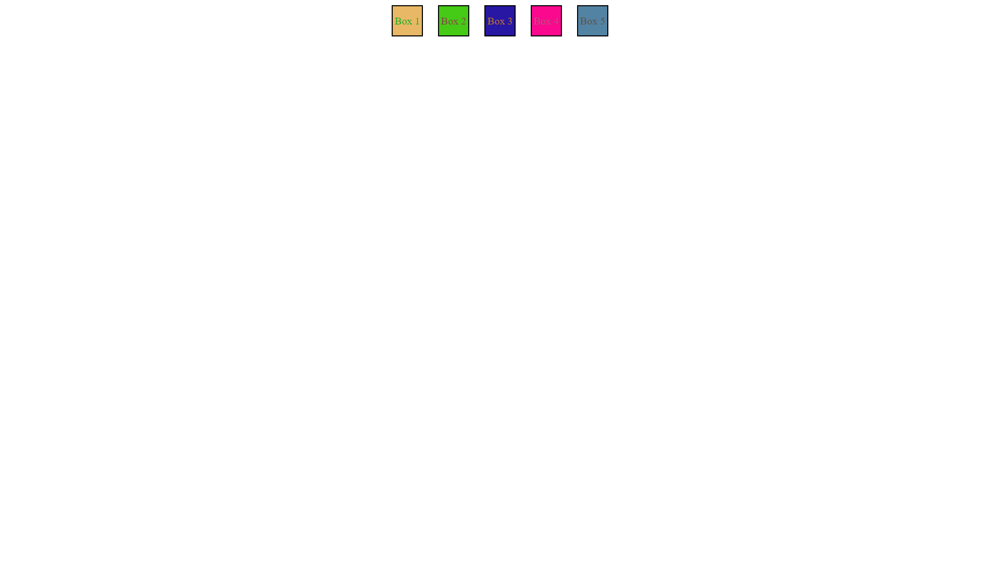
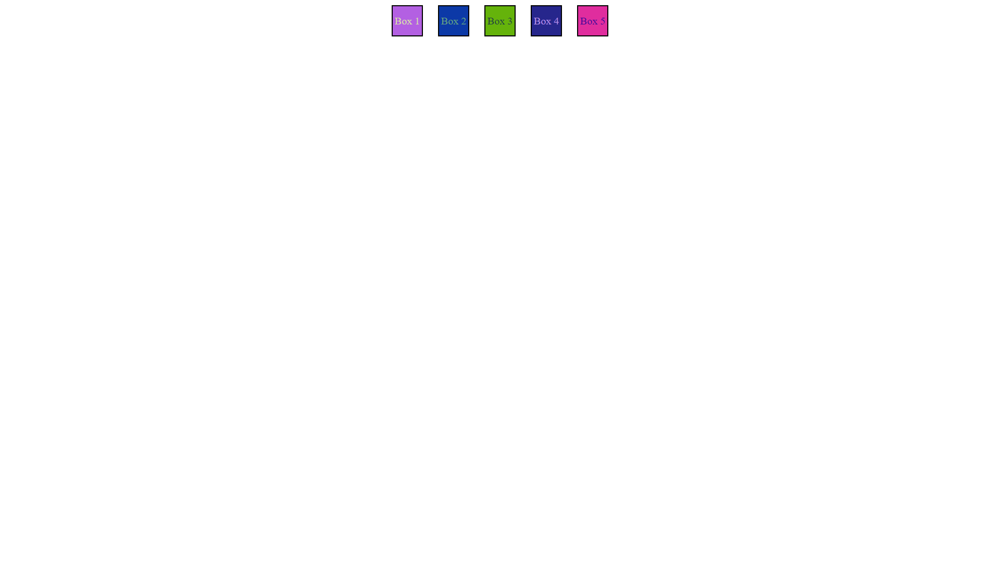

# Random Color Generator

## Overview
The Random Color Generator is a simple web application that generates random colors for a set of boxes. Each box is assigned a random background color and text color when the page loads.

## How It Works
The application uses vanilla JavaScript to generate random RGB color values and applies them to the CSS properties of the HTML elements.

## Code Structure
The project consists of three main files:

1. `index.html`: Contains the structure of the web page. It includes a container div with five child divs, each representing a box.

2. `style.css`: Contains the styling for the boxes and the container. The container is displayed as a flex container, with its child boxes centered and evenly spaced.

3. `script.js`: Contains the JavaScript code that generates the random colors. It selects all the box elements and assigns a random background color and text color to each.

## Screenshots

## How to Run
To run the project, simply open the `index.html` file in your web browser.

## Future Improvements
Future improvements could include adding buttons to generate new colors, or creating different shapes in addition to boxes.